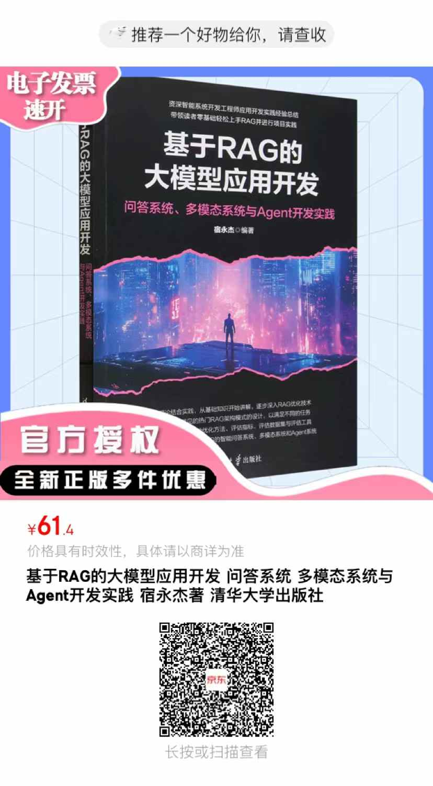

# Python-LLM-Learning
         
这个仓库是《基于RAG的大模型应用开发：问答系统、多模态系统和Agent开发实践》书籍的源码仓库。

微信公众号：AI技术研习社

## 书名： 

《基于RAG的大模型应用开发：问答系统、多模态系统和Agent开发实践》

## 封面

## 购买地址

京东：https://item.jd.com/10212034821305.html